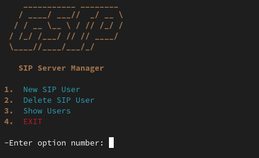

# sip-server-router
Use Your OpenWrt Router as a Sip Server (Asterisk)

With This Script You Can Create Your own Sip Server on Your openwrt Router without any physical or Cloud Servers! 

Save Energy and Money ♻️♾️

How to install? 

Step 1 : Run This Command in Openwrt SSH
```
rm -f asterisk.sh && wget https://raw.githubusercontent.com/amirhosseinchoghaei/sip-server-router/main/asterisk.sh && chmod 777 asterisk.sh && sh asterisk.sh
```

Step 2 : Sip Manage Menu Command :

```
gsip
```




Done!
